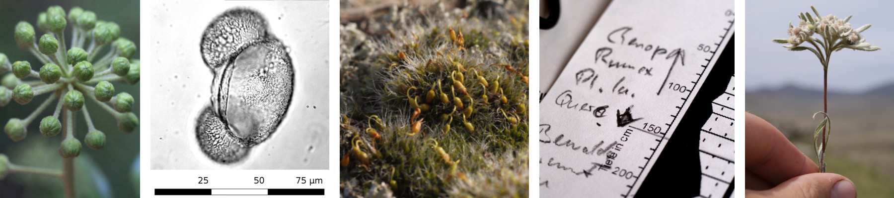
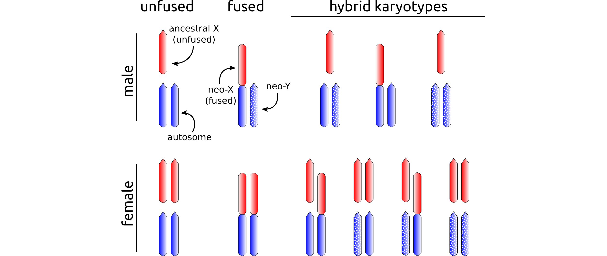

#About Hannes

##I as a person
I am a biologist with wide-spread interest in life-related phenomena. Being a trained botanist I have worked (and published) on Historical Geobotany, Pollen Analysis, Molecular Systematics, Cytogenetics, and Epigenetics of Giant Genomes. In Autumn 2014, I ventured to start a PhD on Population Genetics and Sex Chromosome Evolution in grasshoppers. This allows me to apply my knowledge acquired in the plant world, and it challenges me to go beyond that every day.  
I like scripting in python and R, and I am a keen microscopist. In my spare time, I enjoy nature and I play the clarinet in two London Bands.

##My PhD project
My PhD is on hybridisation and sex chromosome evolution. As a model I use *Podisma pedestris*, an alpine grasshopper species. In *P. pedestris*, there are two chromosomal races possessing different sex chromosome systems. The ancestral (normal) state is an X0 system. (That means unlike in humans there is no Y-chromosome. Females have two X and males have only one.) The other race exhibits a neo-X/neo-Y system. We think this was created by an autotome-to-X fusion creating a big neo-X (fused X) and leaving behind an autosome that occurs in males only. This left-over autosome is thought to be evolving Y-chromosomal features (hence it is being called neo-Y). For instance, we observe reduced recombination between the Y and its homologous bit of the neo-X.  
Both chromosomal races of *P. pedestris* meet and form a narrow hybrid zone which is the target of our research. In the hybrid zone the Y can potentially occur in females, allowing us to ask whether there is sexually antagonistic selection acting on it. Being “Natural Laboratories”, hybrid zones are valuable sources of crosses that would be hard to obtain in the lab (because *P. pedestris* is rather picky about its rearing conditions and because hybridisation is going on for thousands of years now). I am looking forward to address questions like:

* Is the neo-Y evolving similar to a mammalian Y-chromosome?
* Does the X-chromosomal cline across the hybrid zone agree with other markers?
* Is the spread of the neo-sex chromosome system being fuelled by sexually antagonistic selection?

The following figure is to explain the sex-chromosomal combinations expected in *P. pedestris*. The ancestral X-chromosome is shown in red, a pair of autosomes is blue, and the neo-Y is blue with polka dots (because is stems from an autosome). Male karyotypes are shown in the top row, female ones in the bottom. The ancestral configuration is show on the left-hand side, followed by the fused one. The right half of the figure shows the expected hybrid karyotypes. Note the potential occurrence of Y-chromosomes in hybrid females.

