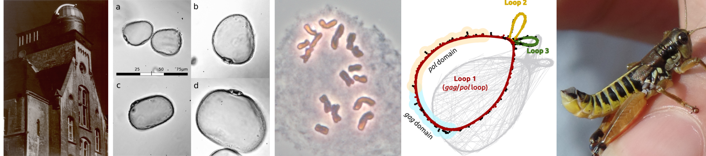

# Hannes Becher -- CV

| 2018|Postdoc with Brian Charlesworth, University of Edinburgh (UK)
| 2014--2018|PhD in Population Genetics with Richard Nichols, Queen Mary University of London (UK)
| 2016--2017|Visiting Research Student with Konrad Lohse at the University of Edinburgh (UK)
| 2013--2014|Research Assistant with Andrew Leitch (Epigenetics of Giant Genomes), Queen Mary University of London (UK)
| 2010--2013|MSc in Systematic Botany and Cytogenetics, Martin-Luther-University Halle-Wittenberg (Germany)
| 2007--2010|BSc in Biology (Palynology), Martin-Luther-University Halle-Wittenberg (Germany)
| 2006|Abitur, Landesschule Pforta (Science Department), Schulpforte (Germany)

## Grants/Awards
* Leonardo-da-Vinci-Fellowship (€6000, enabled me to stay six months in Andrew Leitch's lab) -- 2013
* £2500 for the organisation of [EMPSEB21](http://empseb21.bio.ed.ac.uk/) (student-lead evolutionary conference in Stirling 2015)
* GfBS Travel Grant (€250) -- 2016
* £1000 Training Grant from the [Genetics Society](http://www.genetics.org.uk/) for a stay with the [Lohse Group](http://lohse.bio.ed.ac.uk/) -- 2016

## Memberships
* Genetics Society (Student Member)
* [GfBS](http://www.gfbs-home.de/) (Society for Biological Systematics, Student Member)
* [BLAM](http://blam-bl.de/) (Bryological-Lichenological Workgroup for Central Europe)
* Organising committee [EMPSEB21](http://empseb21.bio.ed.ac.uk/)

				
