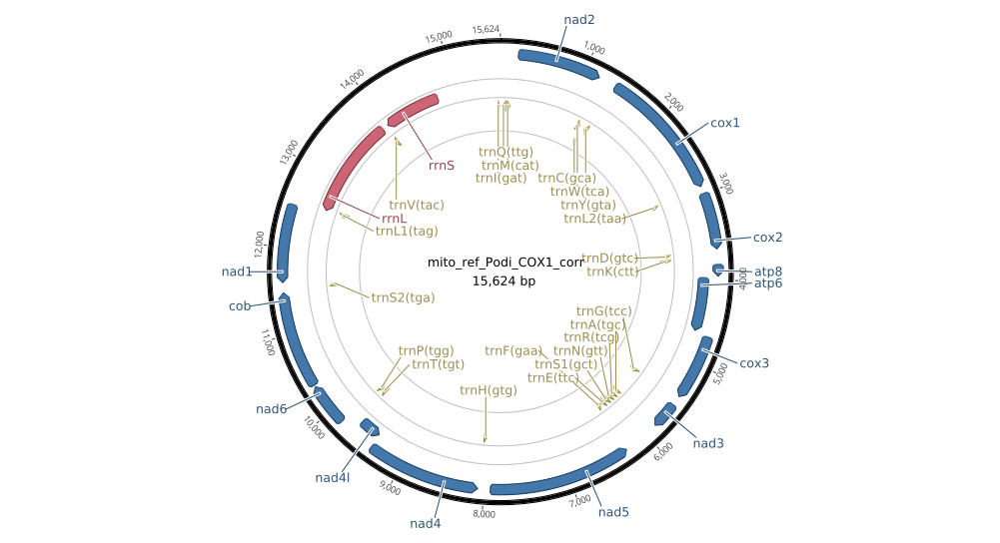

		
# Hannes Becher's web presence

## What's going on
* Bechmarking the assembled *Podisma* transcriptome
* Assembled *Podisma*'s mitochondrial genome and looking for NUMTs (nuclear inserts of mitochondrial DNA)

## Later this year
* [RepeatExplorer Workshop](http://w3lamc.umbr.cas.cz/repeatexplorer/?page_id=14) (České Budějovice, Czechia)
* [Adaptation in Nature](http://www.gfgenetik.de/tagungen/) (Braunschweig, Germany)
 

## Links
* [pairshow](https://github.com/hannesbecher/RE-tools/blob/master/pairshow.R) -- An R script to visualise paired-read realationships in RE clusters

