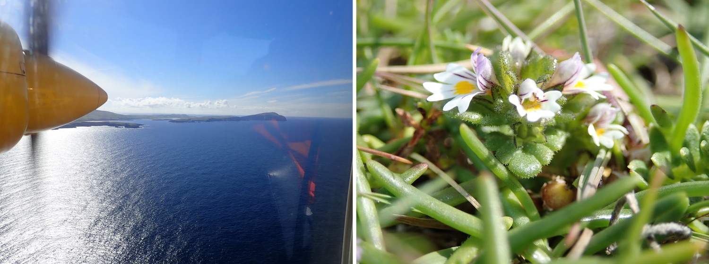

# Hannes Becher's web presence

## What's new?
In July, I started my postdoc in the [Twyford Lab](http://twyford.bio.ed.ac.uk/home) working on local adaptation in tetraploid species of *Euphrasia*.

## From the first *Euphrasia* field trip:

