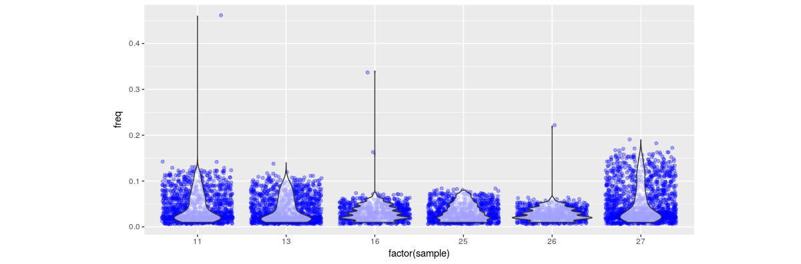

		
# Hannes Becher's web presence

## Hat's goin on?
I am busy working on grasshopper mitochondrial data. Hoping the results will be sent off soon...

## PopGroup talk
[PopGroup50](http://populationgeneticsgroup.org.uk/) is history. If you missed my talk or you would like to have a look again, you can download some slides from [here](misc/PopG_50_public.pdf).

## Links
* [pairshow](https://github.com/hannesbecher/RE-tools/blob/master/pairshow.R) -- An R script to visualise paired-read relationships in RE clusters

