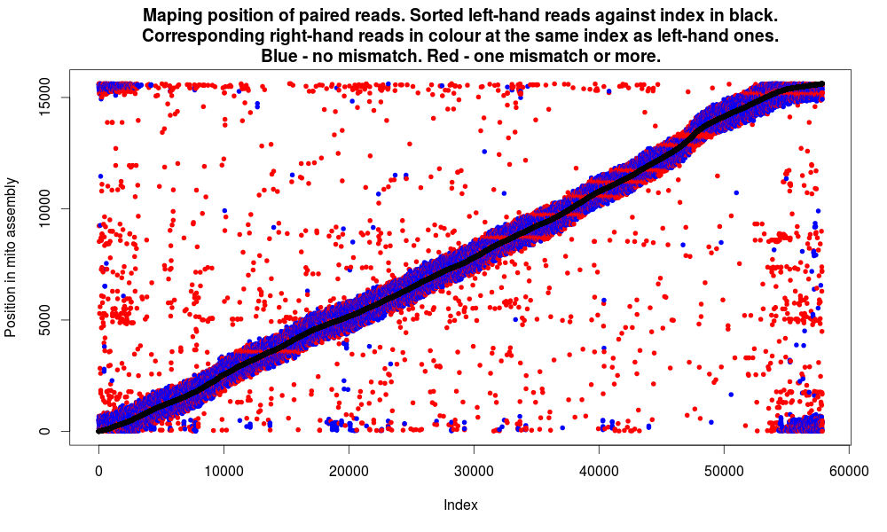

		
# Hannes Becher's web presence

## What's going on
* Still crunching transcriptomes to find race-specific polymorphisms in my grasshoppers.
* Grasshopper PacBio data have arrived! Highly uneven coverage after mapping to michtochondrial genome makes me curious what is going on with regard to NUMTs. Also, are there inter-race differences?
* Comparing these data to previously generated NextSeq reads and makin silly-looking graphs...

## Looking forward to
* [GfbS-Meeting in Munich](http://www.en.palaeontologie.geowissenschaften.uni-muenchen.de/gfbs2016/index.html) February 21st--24th
