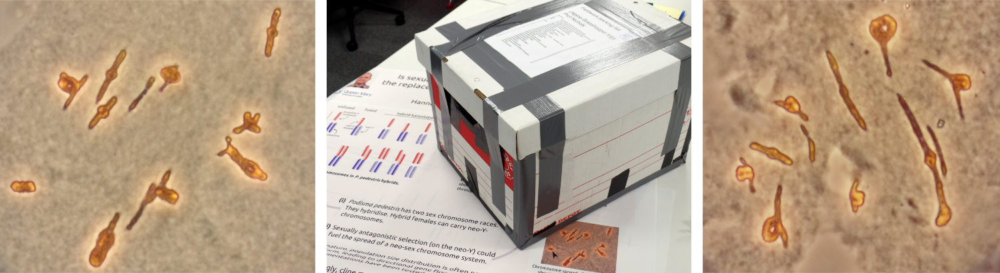

		
#Hannes Becher's web presence

The annual grasshopper field trip is coming up and I cannot wait to leave Old Blighty for a while and go to the mountains of Southern France. The science box is packed, tickets are booked. Now, it is time to get the material on which my PhD will depend (no pressure). There might be some photos soon.

In August, I will attend ESEB in Lausanne. I am going to present a poster which can be previewed [here](misc/Becher_ESEB_public.png). The modelling was done using the scrips from my GitHub repo [FvU](https://github.com/SBCSnicholsLab/FvU).
