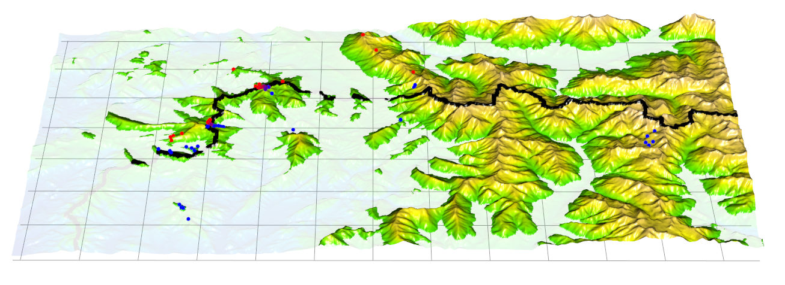

		
# Hannes Becher's web presence

## Roscoff
I am presenting a poster at the [Sex Uncovered conference](http://www.cnrs.fr/insb/cjm/2018/Schwander_e.html) at Roscoff. A downloadable version can be found [here](misc/Becher_Roscoff_poster.png). The references are [here](misc/Becher_Roscoff_poster_refs.txt).

## What's new?
* I passed my viva, yippee!
* I am currently working in the Charlesworth lab, exploring the interactions of recombination and linked selection in Drosophila.
* Later this year, I will commence a postdoc in the [lab of Alex Twyford](http://twyford.bio.ed.ac.uk) working on adaptation in *Euphrasia*. So I'll finally return to working with plants.

## A hybrid zone pic:

